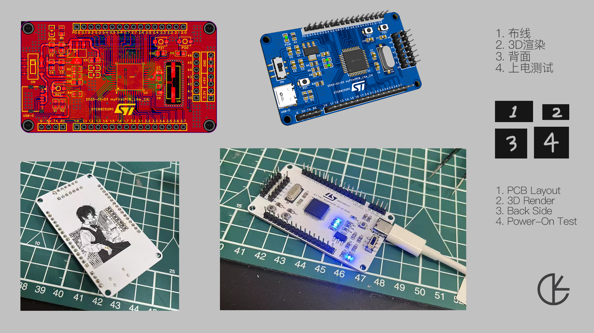
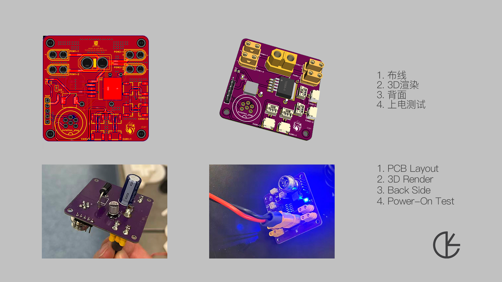
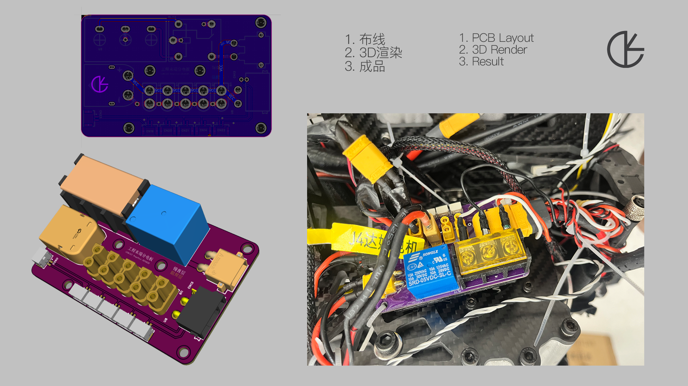

# 我的 PCB 设计记录

[English Version](./README.en.md)

这是一个初学者记录自己电路板设计历程的仓库。从第一块 51 单片机开发板，到为机械臂项目设计的电源分配板。
每一个设计都代表着学习过程中的一个阶段。所有设计均使用**立创EDA**（嘉立创旗下免费 EDA 工具）完成。

AI (Claude and Claude Code) 在写README上帮我减轻许多负担

---

## 仓库结构

```
my_PCB_works/
├── docs/
│   ├── images/                              # PCB 渲染图与布线截图
│   ├── SCH_STC89C52_Dev_Board.pdf           # 51 单片机核心板原理图
│   ├── SCH_Buck_Converter_PDB.pdf           # 降压分电板原理图
│   └── SCH_Robot_Arm_End_PDB.pdf           # 机械臂末端分电板原理图
├── MCU_Development_Board/
│   └── STC89C52_Dev_Board.eprj2            # 51 单片机核心开发板
└── Power_Distribution_Board/
    ├── Buck_Converter_PDB/
    │   ├── Buck_Converter_PDB.eprj2         # 带 LM2596 降压电路的分电板（终版）
    │   └── Buck_Converter_PDB_Draft.eprj2   # 同上，草稿版本
    └── Robot_Arm_End_PDB/
        └── Robot_Arm_End_PDB.eprj2          # 机械臂末端分电板
```

---

## 项目介绍

### 1. STC89C52 单片机核心开发板
> `MCU_Development_Board/`

[查看原理图](./docs/SCH_STC89C52_Dev_Board.pdf)

这是跟着哔哩哔哩 UP 主 [Expert电子实验室](https://www.bilibili.com/video/BV1At421h7Ui/) 的视频完成的 51 单片机核心板。内容涵盖 PCB 发展历程、基本元件与 Datasheet 阅读、电路原理、EDA 布线，最后手把手教如何在立创EDA 上下单打样，非常适合新手入门，强力推荐。

基于 STC89C52RC（8051 架构）的单片机核心板。

**主要元器件：**
| 元器件 | 型号 | 用途 |
|--------|------|------|
| MCU | STC89C52RC-40I-LQFP44 | 主控芯片 |
| LDO 稳压 | AMS1117-3.3 | 3.3V 电源 |
| USB 接口 | TYPE-C 2.0 6PIN | 供电 / 串口下载 |
| 晶振 | 12MHz | 系统时钟 |
| 复位按键 | 轻触开关 3×4mm | 手动复位 |



---

### 2. 带降压电路的分电板
> `Power_Distribution_Board/Buck_Converter_PDB/`

[查看原理图](./docs/SCH_Buck_Converter_PDB.pdf)

集成 LM2596 Buck 降压电路的电源分配板，适用于多模块供电场景。

**主要元器件：**
| 元器件 | 型号 | 用途 |
|--------|------|------|
| 降压芯片 | LM2596SX-3.3 | Buck 降压，输出 3.3V / 最大 3A |
| 储能电感 | 68uH / 2A | Buck 电路核心元件 |
| 肖特基二极管 | 1N5824 / 1N5825 | 续流与保护 |
| 滤波电容 | 220uF + 470uF | 输入输出滤波 |
| 电源输入 | XT60-F | 锂电池输入（大电流） |
| 电源输出 | XT30UW-F.G.Y (15A) | 主路电源输出 |
| 小信号输出 | JST GH 1.25mm | 低功耗模块供电 |
| 接线端子 | KF301 5.0mm | 通用接线 |

> **安全提示：** 使用前确认输入电压在 LM2596 额定范围内（4.5V–40V）。RM官方电池电压为24V

**`Buck_Converter_PDB_Draft.eprj2`** 为同一设计的早期草稿，这一版本没有设计降压电路，只是为了验证电路板尺寸能放入现有的机械结构中，保留供参考。
现在已经忘了当时具体是什么需求需要把 24V 转成 3.3V，但记得经过一番搜寻选定了 LM2596SX 作为降压芯片，查阅 Datasheet 后根据样例电路进行了设计。用战队经费摸着石头过河做出来的（感谢战队培养），现在回头看电路板背后的超大电容，有点杀鸡用牛刀的感觉。



---

### 3. 机械臂末端分电板
> `Power_Distribution_Board/Robot_Arm_End_PDB/`

[查看原理图](./docs/SCH_Robot_Arm_End_PDB.pdf)

专为机械臂末端设计的纯分电板，无板载变压电路，直接将输入电源分配至多路输出。由于气泵放在了末端执行器端，还设计了一个气泵的 PWM 控制电路。

**主要接口与元器件：**
| 元器件 | 型号 | 用途 |
|--------|------|------|
| 电源输入 | XT60-F | 24V 主电源输入 |
| 电源输出 | XT30UW-F.G.Y (15A) | 防水电源输出 |
| 信号接口 | JST GH 1.25mm | CAN 总线信号输入输出 |
| 控制接口 | KF301 螺丝端子 | 气泵 PWM 控制信号输入 |



---

## 其他信息
关于文件格式：`.eprj2` 立创EDA 专业版工程文件，如需打开工程文件，请使用[立创EDA 专业版](https://lceda.cn/)。  
关于打样：工程文件可在立创EDA 内直接导出 Gerber，嘉立创打样。  
关于作者：**Like CAI** GitHub：[https://github.com/humble-learner006](https://github.com/humble-learner006) 正在努力探索机器人全栈技能树。  

---

## 开源协议

本项目采用 [MIT 许可证](./LICENSE)。

你可以自由使用、修改和生产这些设计，注明出处不是强制要求，但非常欢迎。

## 免责声明

    本仓库中的所有设计仅供学习与参考，不保证其 
    可靠性或适用于任何特定用途。
    自行制造或使用这些设计所产生的任何后果由使 
    用者自行承担。